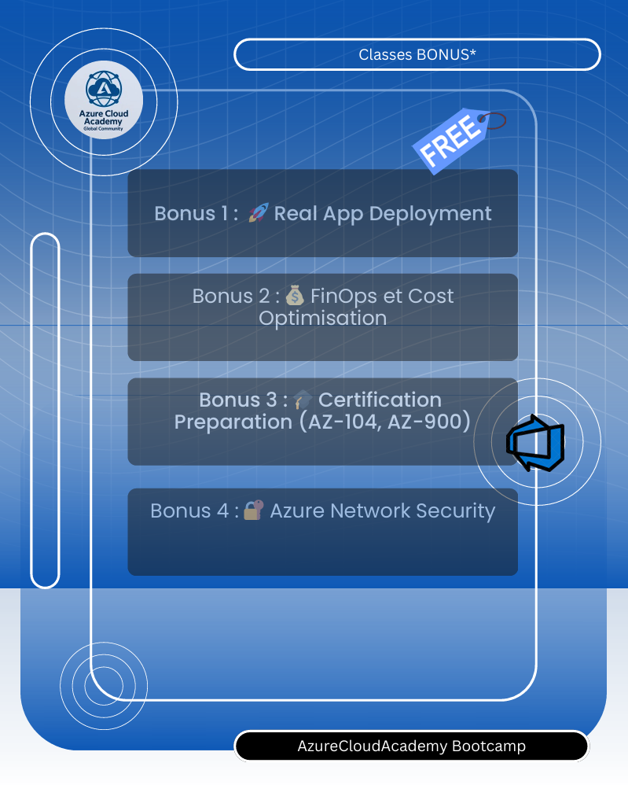

# Labs
Labs public repository to share labs content with participants

## 1) 📌 Labs structure plan

- **Lab 1:** [Azure Subscription and Developer Workstation Setup steps guide](lab1/lab1.md)
- **Lab 2:** [Creating Your First Project and Setting up Your Organization](lab2/lab2.md)
- **Lab 3:** [Integrating Azure AD with Azure DevOps](lab3/lab3.md)
- **Lab 4:** [Configuring Project Permissions](lab4/lab4.md)
- **Lab 5:** [Initialize and Connect to Your First Git - Azure Repository](lab5/lab5.md)
- **Lab 6:** [Initialize Cloud Shell and Azure DevOps CLI](lab6/lab6.md)
- **Lab 7:** [Getting Started with Git and GitHub](lab7/lab7.md)
- **Lab 8:** [Creating a Branch and Merging Changes](lab8/lab8.md)
- **Lab 9:** [Code Reviews with Git Pull Requests](lab9/lab9.md)
- **Lab 10:** [Deploy Application in AKS + AI Foundry](lab10/lab10.md)
- **Lab 11:** [Blue-green Deployments with Azure App Service and GitHub](lab11/lab11.md)
- **Lab 12:** [Create a CI/CD Pipeline for .NET or Java with the Azure DevOps Project](lab12/lab12.md)
- **Lab 13:** [Configuring CI/CD Pipelines as Code with YAML in Azure DevOps](lab13/lab13.md)
- **Lab 14:** [Deploying a Docker Web Application to Azure App Service](lab14/lab14.md)
- **Lab 15:** [Deploying to Azure VM using Deployment](lab15/lab15.md)

## 2) 📌 Quickstart

## 3) 🙋‍♀️ Frequently Asked Questions

For answers to common questions about Azure DevOps, see the Frequently Asked Questions.

<<<<<<< Updated upstream
=======
### Q. [CI/CD Pipeline creation] Why chosing Agent Deployment rather than Just manual 
In order to limit Operational overhead and managing role based access resources, MS Azure recommands using Agent deployment

### Q. [Azure Load testing] Report export?
For now we shown only csv, excel report test results generation.

### Q. [App Services, Function runtime] What's the behind cost calculation for Pay as you go on Function App usage ?
First 1000 requests for the Free tier is free, then cost depends on CPU function usage.

>>>>>>> Stashed changes
## 4) 📌 Contributing

We welcome contributions! During preview, please file issues for bugs, enhancements, or documentation improvements.

See our Contributions Guide for:

- 🛠️ Development setup
- ✨ Adding new tools
- 📝 Code style & testing
- 🔄 Pull request process
- 🤝 Code of Conduct

This project follows the Microsoft Open Source Code of Conduct. For questions, see the FAQ or contact contributors.

## 5) Only for Students!

