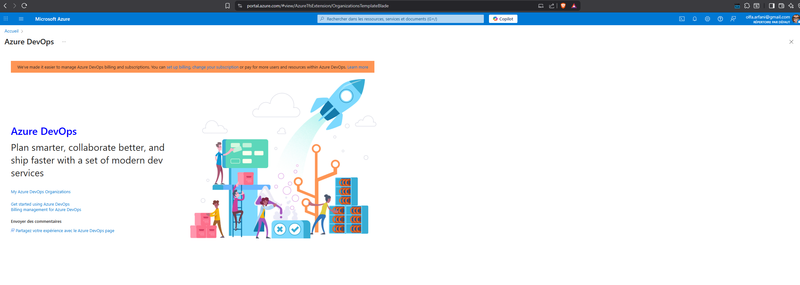

**Prerequisites**
1. Create outlook account

https://www.microsoft.com/en-us/microsoft-365/outlook/email-and-calendar-software-microsoft-outlook?deeplink=%2fowa%2f&sdf=0 

2. Create Azure Accounts 
https://azure.microsoft.com/en-us/ 

https://portal.azure.com/#allservices/category/All 

3. Azure DevOps
https://aex.dev.azure.com/me?mkt=en-US 
https://dev.azure.com/ 
https://dev.azure.com/Gopal-DevOps2025-July/ 

 4. Create GitHub Accounts 
https://github.com/ 

----------------------------------------***************----------------------------------------

# First Project Setup

This section provides instructions for setting up your first project. Follow the steps below to initialize your development environment, install necessary dependencies, and verify the setup.

## EShopWeb solution Github project : https://github.com/MicrosoftLearning/eShopOnWeb

## Objectives lab1
After you complete this lab, you will be able to:

- Create project, Manage teams, areas, and iterations.
- Manage work items.
- Manage sprints and capacity.
- Customize Kanban boards.
- Define dashboards.
- Customize team process.

## 1) Choose Free tier for Azure Devops
## 2) Connect to Aure portal
 
 - Go to `https://portal.azure.com` then to organisation template`https://portal.azure.com/#view/AzureTfsExtension/OrganizationsTemplateBlade`
 - Organisation already created "olfaarfani" in this image screenshot
  
  

 ## 3) Create a project
  - project name "shoppingApp"
  - Setting to "private"
  - Advanced : Integrate with Git repository
  - Different work item types : Basic, Agile, Scrum, CMMI
