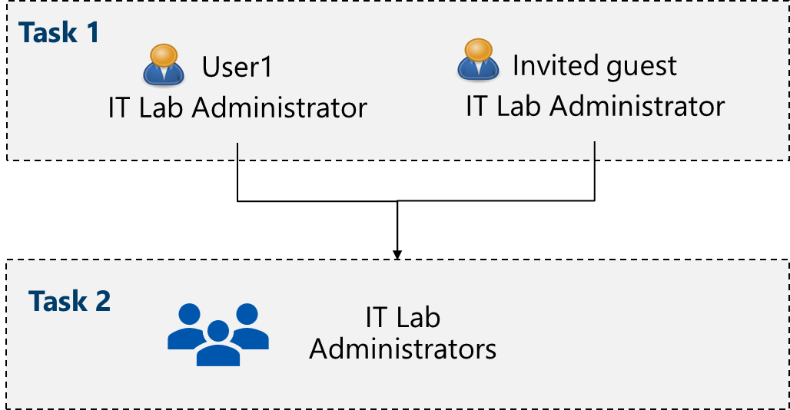
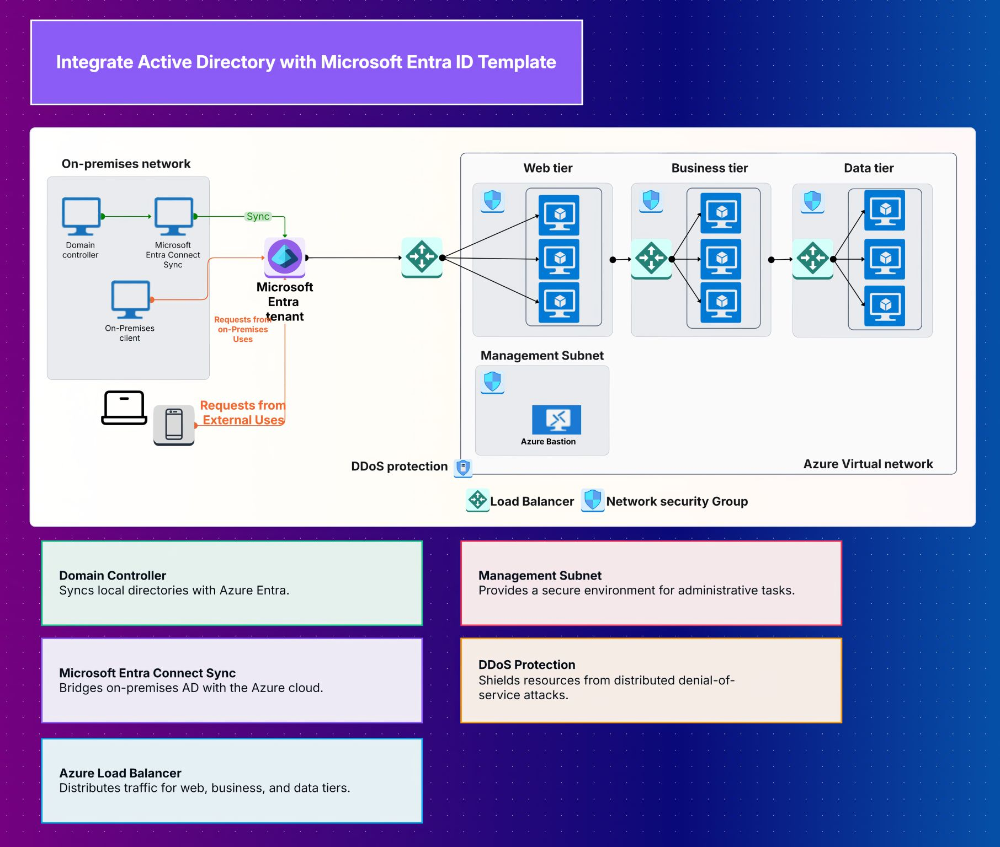

# Integrating Active Directory

In this lab, we will focus on how to integrate Azure Active Directory for managing user and group access. We will discuss two approaches: the classic manual integration method and the template-based method. For the template method, you will need to subscribe to the "AD Entra Integration" template using a Cloudairy account.ive Directory

## Important notes

- What is A tenant ? :  represents your organization and helps you to manage a specific instance of Microsoft cloud services for your internal and external users.

- Microsoft Entra ID has user and guest accounts. Each account has a level of access specific to the scope of work expected to be done.

- Groups combine together related users or devices. There are two types of groups including Security and Microsoft 365.

- Group membership can be statically or dynamically assigned.
## 1. Classic Integration Method

The classic approach involves manual configuration of Active Directory integration. Begin by installing the necessary connectors or agents on your server. Manually configure synchronization rules, user and group mappings, and set up authentication protocols. This method offers more granular control but requires a deeper understanding of Active Directory and integration processes.

2 Tasks to do

### 1. Create and configure user accounts

- Create new user

Setting	Value
User principal name	az104-user1
Display name	az104-user1
Auto-generate password	checked
Account enabled	checked
Job title (Properties tab)	IT Lab Administrator
Department (Properties tab)	IT
Usage location (Properties tab)	<location>

- Invite external user

**Sign in your tenant**

PowerShell ``

### 2. Create Group and add members

PowerShell ``

## 2. Using Entra ID Template

Leverage the Entra ID integration template for a streamlined setup. This method provides a guided experience, automating much of the configuration. Start by selecting the Entra ID template in your integration portal, then follow the prompts to connect your Active Directory domain. The template handles synchronization settings, user provisioning, and permissions mapping, reducing manual steps and potential errors.

Who Benefits from this Template?

This template is perfect for:

  - IT administrators tired of managing user accounts in multiple systems.
  - Small business owners who want to use cloud services without the complexity.
  - System managers responsible for keeping employee access simple and secure.
  - Companies moving from traditional office setups to hybrid work environments.
  - Organizations that need their hybrid identity Azure solution to actually work smoothly.
  - IT consultants helping businesses adopt cloud services without breaking what already works.
  - Anyone who's frustrated with having different login processes for office and cloud applications.
  - Teams looking to streamline user management across on-premises and cloud systems.

Benefits Of the Integrate Active Directory with Microsoft Entra ID Template:

  - **One login for everything**: Employees use the same username and password for office and cloud applications.
  - **Simplified user management**: Add, remove, or change user permissions in one place and have it apply everywhere.
  - **Reduced help desk calls**: Fewer password reset requests and login problems to deal with.
  - **Better security**: Use your existing security policies and group structures in the cloud.
  - **Time savings**: Stop manually managing users in multiple systems.
  - **Seamless cloud adoption**: Start using cloud services without forcing employees to learn new login processes.
  - **Automatic synchronization**: Keep user information up-to-date across all systems without manual work.
  - **Cost efficiency**: Avoid expensive identity management solutions by extending what you already have.
  - **Future-ready setup**: Build a foundation that works as you adopt more cloud services.

Getting Started with the Template in Cloudairy:

It's easy to get started with the "Integrate Active Directory with Microsoft Entra ID" template in Cloudairy:

1.  **Log in to Cloudairy**: Get into your Cloudairy account.
2.  **Go to Templates Library**: Find the section dedicated to all the available templates.
3.  **Search for "Integrate Active Directory with Microsoft Entra ID Template.."**: Use the search bar to quickly find this specific template.
4.  **Preview the Template**: Go to : `https://app.cloudairy.com/templates` Click on it to see its integration workflow and connection steps.
5.  **Start Planning**: Select "Open Template" to begin customizing it for your environment.
6.  **Map Your Current Setup**: Document your existing on-prem directory Azure structure and user groups.
7.  **Configure Sync Settings**: Plan how your Azure AD Sync will handle user accounts and permissions.
8.  **Design Your Integration**: Set up the process to integrate AD with Entra ID based on your company's needs.
9.  **Make it Yours**: Customize the hybrid identity Azure template to match your specific security policies and requirements.

# 🚀 Azure Cloud Academy – Weekly Assignment 🌍

✅ Create a user account (display name, under IT department, autogenerate password)
✅ Invite external account

📸 Final Task:
Take a screenshot of your setup, create a LinkedIn post, and tag the Azure Cloud Academy page so we can celebrate your progress together 🎉